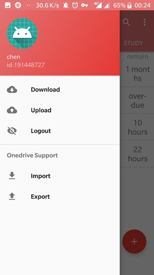

# Intell_TODO_list
This is a java based android TODO list, which could easily arrange your scheduler and sync them to cloud.
Server side code in another branch.

### Function
1. Intelligent event sort 
1. Task paging
1. Task searching
1. Cloud sync
1. Task sharing
1. Deadline notification
1. Multi-theme
1. Advertisement module

### View

### Needed improvement(may never be done)
* Auto sync
* Improved serviced
* ImprovedNotification
* Ended event archive
* Dynamic search
